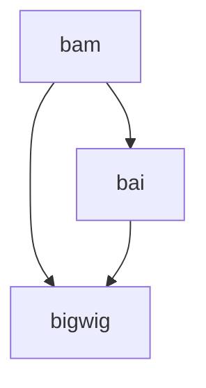

# ChIP_seq_pipeline
WIP: General idea fastq -> visualization + analysis for ChIP data

To Do:
- [ ] Fix mermaid flowchart above - update it when I add more things
- [ ] Figure a way to deal with the replicates/input files (config?)
- [ ] Start the pipeline from fastq; if someone has cram/bam/whatever what will they do?
- [ ] Make it more verbose in the command line (tags)
- [ ] Add comments in the script
- [ ] Add thread option in the script
- [ ] After fixing the input and figuring out a way to deal with the replicates, continue with the second workflow (MACS3, mscp, intervene, gseapy)
- [ ] Find an alternative to cistrome go 
