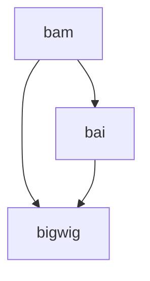

# ChIP_seq_pipeline
WIP: General idea fastq -> visualization + analysis for ChIP data

To Do:
- fix mermaid flowchart above
- figure a way to deal with the replicates/input files (config?)
- start the pipeline from fastq; if someone has cram/bam/whatever what will they do?
- make it more verbose in the command line (tags)
- add comments in the script
