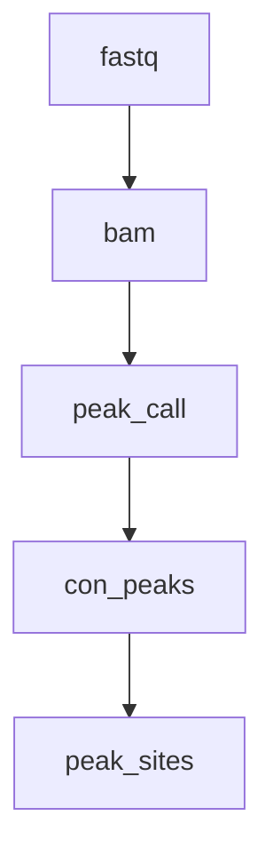

# ChIP_seq_pipeline
WIP: General idea fastq -> visualization + analysis for ChIP data

```mermaid
flowchart TD
    fastq --> bam
    bam --> peak_call
    peak_call --> con_peaks
    con_peaks --> peak_sites
```
