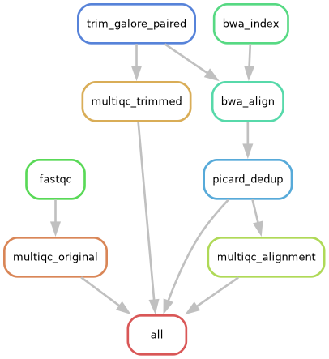
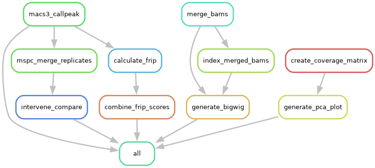

## The pipeline is divided into 4 pipelines:
#### 1: `align.smk`: Alignment starting from fastq files 

- Information:
  - We need to have `sample1.fastq.gz` files or `sample1_R1.fastq.gz` & `sample1_R2.fastq.gz`.
  - Modify the `config/align.yaml` accordingly.
  - The pipeline will be different depending on the chosen aligner and sequencing type (paired-end/single-end).
  - Reference genome `ref_genome.fa` should be where the indexed files of the aligners are. If they are not there, they will be created. 
  - Many multiqc reports from multiple points of the pipeline.
- Folders of the pipeline:
  - `config/align.yaml`
  - `ref_genome.fa`
  - Run the pipeline `snakemake -s align.smk -c 8 -j 5 --use-conda`, where -c is the number of cores and -j are the number of jobs running in parallel (mostly for servers). If you know your setting, change those however you like. The default cores that are used for this pipeline are 8.
- How to run:
  - Fill in the `config/align.yaml`
  - Install the necessary packages, through the `.yml` file in `/envs`.
#### 2: `transform_files.smk`: Transform files from cram to bam and vice versa.
- Information:
  - We usually receive data in cram format, so we do not have to align every sample.
  - The reverse process is mostly used for storing since cram files consume 30-60% less space than bam files.
- Folders of the pipeline:
  - `config/transform_files.yaml`: The file that needs to be modified by the user.
  - `/path/to/reference/genome`: the fasta file of the reference genome. If you don't know what reference genome to use then you can go to the original cram/bam file and do `samtools view -H file.bam/cram`. With this, we can see the reference genome that was used and all the other commands that were applied to the file.
  - The pipeline will create the `/aligned_reads` folders to output the bam files or will search this directory for bam files if we want it to create cram files for storing. This is intentional and a way to connect the pipelines and avoid multiple folders.
- How to run:
  - Make sure the necessary directories/files mentioned above are there.
  - Install the necessary packages, through the `.yml` file in `/envs`.
  - Modify the `config/transform_files.yaml` according to what you want.
  - Run the pipeline `snakemake -s transform_files.smk -c 8 -j 5`, where -c is the number of cores and -j are the number of jobs running in parallel (mostly for servers). If you know your settings, change those however you like. The default cores that are used for this pipeline are 8.
#### 3: `peak_n_bigwigs.smk`: By running this pipeline you get peaks and bigwig files starting from bam files.

- Information:
  - bam files should be indexed and sorted.
  - Modify the `config/peak_n_bigwig.yaml` accordingly.
  - The pipeline will continue per condition if `merge_replicates = True`. If it is `False`, you get the peak files and bigwigs only.
- Folders of the pipeline:
  - `/aligned_reads`: where the bams are located,
  - `/config`: It contains the `config/peak_n_bigwig.yaml`, which is needed to modify the pipeline accordingly, and `config/config.json` which is needed for getting the consensus peaks (MSPC) **NOTE: this works in Linux/Windows, for mac we need a different `json` file.**
  - `/envs`: Contains the conda environment for reproducible results.
  - `/logs`: The log outputs of the pipeline. Some will be empty, but keep them, because if there is an error, we can closely inspect it.
  - `/results`: This folder will be created and contain the multiple pipeline results.
  - `samples.txt`: a tab-separated text file that contains the *bam file* in `/aligned_reads` (without the .bam extension), the *condition*, *replicates*, and *inputs/controls* for peak calling if there are any.
- How to run:
  - Download the folders mentioned above. You can use git clone for that or manually install them.
  - Install the necessary packages, through the `.yml` file in `/envs`. Moreover, you need to install (mspc)[https://genometric.github.io/MSPC/docs/installation] and add it to the path (add to `.bashrc` the following `export PATH=$PATH:/path/to/mspc`, where you modify the `path/to/mspc`.
  - Modify the `samples.txt` and `config/peak_n_bigwig.yaml` according to your data.
  - Run the pipeline `snakemake -s peak_n_bigwigs.smk -c 10 -j 5`, where -c is the number of cores and -j are the number of jobs running in parallel (mostly for servers). If you know your setting, change those however you like.
   
If something does not work or for any questions, contact me at [Theo Chalkiadakis](mailto:t.chalkiadakis@umcutrecht.nl).
